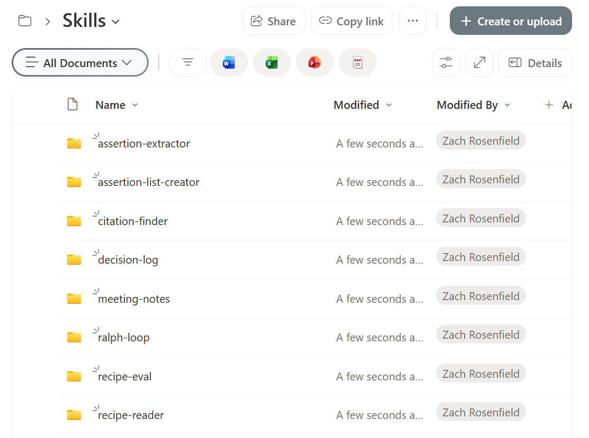

# Skills

AI skills are instruction files that give a Copilot agent a focused capability. Each skill lives in its own folder and is installed by uploading that folder to the **Skills** library in SharePoint.

## Available Skills

| Folder | Skill | Description |
|---|---|---|
| [authoring-sharepoint-markdown/](./authoring-sharepoint-markdown/) | Authoring SharePoint Markdown | Converts documents and gathered content into SharePoint-compatible markdown files. Covers formatting rules, templates, and a six-step workflow for publishing to SharePoint pages and web parts. |
| [brainstorming-design-docs/](./brainstorming-design-docs/) | Brainstorming to Design Doc | Guides a raw idea through structured brainstorming into a complete design document. Asks clarifying questions one at a time, proposes alternatives with trade-offs, builds the design incrementally with user approval, then delivers SharePoint-ready Markdown. |
| [copy-editing/](./copy-editing/) | Copy Editing | Edits documents using seven sequential sweeps: Clarity, Voice & Tone, So What, Prove It, Specificity, Scannability, and Action. Run all sweeps for a full edit, or target a specific one. |
| [decision-log/](./decision-log/) | Decision Log | Extracts Decision Records from video or audio transcripts. Captures the problem, options considered, who decided, rationale, dissent, conditions, and follow-on actions. |
| [executive-summary/](./executive-summary/) | Executive Summary | Distills long documents, reports, or transcripts into tight one-page summaries for leadership audiences. Surfaces the core situation, key findings, recommendation, and what the reader needs to do. |
| [faq-building/](./faq-building/) | FAQ Building | Builds structured FAQ pages from source documents, policies, process guides, or topic briefs. Anticipates reader questions, groups them into themes, writes clear Q&A pairs, and delivers SharePoint-ready Markdown. |
| [forest-style/](./forest-style/) | Forest-Style Brand | Applies the forest-style brand system to any visual output, document, web content, presentation, or interface element. Covers the full color palette, typography, spacing, component styles, and voice rules. |
| [gap-analysis/](./gap-analysis/) | Gap Analysis | Compares two documents and surfaces what is missing, conflicting, changed, or new between them. Categorizes findings by severity and summarizes implications and recommended actions. |
| [linkedin-post/](./linkedin-post/) | LinkedIn Post Writing | Crafts high-performing LinkedIn posts from any topic, story, announcement, or idea. Covers hook formulas, format rules, five content types, and an optimization checklist. |
| [meeting-notes/](./meeting-notes/) | Meeting Notes | Transforms raw video or audio transcripts into polished, structured meeting summaries. Handles messy auto-generated transcripts, extracts decisions, action items, discussion threads, and key quotes. |
| [project-brief/](./project-brief/) | Project Brief | Turns a rough idea or stakeholder request into a structured project brief. Asks clarifying questions to establish problem, goals, success criteria, scope, stakeholders, and risks, then delivers a decision-ready document. |
| [ralph-loop/](./ralph-loop/) | RALPH Loop | A self-evaluating iterative execution pattern (Reason → Act → Look → Probe → Harden). Keeps the agent looping until all success criteria hit a configurable score threshold. |
| [style-guidelines/](./style-guidelines/) | Brand Style Guide Template | A fill-in-the-blank template for turning any organization's brand guide into an AI skill. Covers color palette, typography, spacing tokens, and component styles. |
| [uppababy-brand-review/](./uppababy-brand-review/) | UPPAbaby Brand Compliance Review | Reviews any content file against UPPAbaby brand guidelines. Produces a weighted scorecard across five categories plus a prioritized remediation list. |
| [youtube-description/](./youtube-description/) | YouTube Description Generator | Turns a video transcript into an engaging YouTube description with a hook, summary, timestamps, key takeaways, and hashtags. |

## Installing a Skill

Skills follow the [agentskills.io specification](https://agentskills.io/specification). The `Skills/` library in SharePoint is created automatically — install by uploading the skill folder into it.

1. Download the skill folder (e.g., `copy-editing/`)
2. In your SharePoint site, open the **Agent Assets** library
3. Navigate into the **Skills** folder (auto-created)
4. Upload the folder — the agent discovers it by the `name` field in `SKILL.md`



## Creating a Skill

A skill is a folder containing a single `SKILL.md` file. The folder name must match the `name` field in the frontmatter exactly.

**Where it goes in SharePoint:** `Skills/<skill-name>/SKILL.md`

**Minimal example — `Skills/summarize-page/SKILL.md`:**

```markdown
---
name: summarize-page
description: Summarizes a SharePoint page in 3 bullet points.
  Use when the user asks for a quick summary of a page.
---

# Summarize Page

## Instructions

1. Read the full content of the specified page.
2. Identify the 3 most important points.
3. Return a bulleted summary, each bullet no longer than one sentence.
```

That's a complete, valid skill. The frontmatter tells the agent when to activate it; the body tells it what to do.

## Contributing a Skill

Skills work best when they are:
- **Focused** — one capability per file
- **Self-contained** — no external dependencies required to use it
- **Documented** — frontmatter with `name` and `description` so agents can self-select the skill
