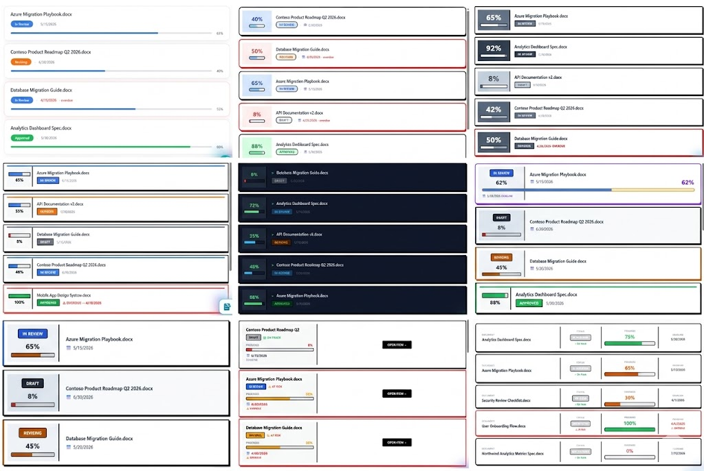

# Skills

AI skills are instruction files that give a Copilot agent a focused capability. Each skill lives in its own folder and is installed by uploading that folder to the **Skills** library in SharePoint.

Skills are organized into categories:

- [AI](#ai) — Agent patterns, evaluation, and meta-skills
- [Documents](#documents) — Structured document creation and transformation
- [Knowledge](#knowledge) — Knowledge base management and retrieval
- [Operations](#operations) — Business operations, reports, and delivery
- [Styling](#styling) — Brand systems and visual compliance
- [Writing](#writing) — Content creation and editing

---

## AI

| Folder | Skill | Description |
|---|---|---|
| [ai/improve-skills/](./ai/improve-skills/) | Improve Skills | Optimizes any AI in SharePoint skill by iteratively running it against test inputs, scoring outputs with binary evals, mutating the prompt to fix failures, and keeping improvements. Adapts Karpathy's autoresearch methodology to AI in SharePoint's multi-turn conversation architecture. |
| [ai/ralph-loop/](./ai/ralph-loop/) | RALPH Loop | A self-evaluating iterative execution pattern (Reason → Act → Look → Probe → Harden). Keeps the agent looping until all success criteria hit a configurable score threshold. |

## Documents

| Folder | Skill | Description |
|---|---|---|
| [documents/authoring-sharepoint-markdown/](./documents/authoring-sharepoint-markdown/) | Authoring SharePoint Markdown | Converts documents and gathered content into SharePoint-compatible markdown files. Covers formatting rules, templates, and a six-step workflow for publishing to SharePoint pages and web parts. |
| [documents/brainstorming-design-docs/](./documents/brainstorming-design-docs/) | Brainstorming to Design Doc | Guides a raw idea through structured brainstorming into a complete design document. Asks clarifying questions one at a time, proposes alternatives with trade-offs, builds the design incrementally with user approval, then delivers SharePoint-ready Markdown. |
| [documents/decision-log/](./documents/decision-log/) | Decision Log | Extracts Decision Records from video or audio transcripts. Captures the problem, options considered, who decided, rationale, dissent, conditions, and follow-on actions. |
| [documents/faq-building/](./documents/faq-building/) | FAQ Building | Builds structured FAQ pages from source documents, policies, process guides, or topic briefs. Anticipates reader questions, groups them into themes, writes clear Q&A pairs, and delivers SharePoint-ready Markdown. |
| [documents/gap-analysis/](./documents/gap-analysis/) | Gap Analysis | Compares two documents and surfaces what is missing, conflicting, changed, or new between them. Categorizes findings by severity and summarizes implications and recommended actions. |

## Knowledge

| Folder | Skill | Description |
|---|---|---|
| [knowledge/autoresearch/](./knowledge/autoresearch/) | Autoresearch | Performs deep multi-step research on a topic by iteratively searching, reading, and synthesizing sources until a comprehensive answer is reached. |
| [knowledge/find-expert/](./knowledge/find-expert/) | Find Expert | Matches open Knowledge Gaps items to subject matter experts in the Expert Directory and assigns them. Part of the Living Knowledge Base skill set. |
| [knowledge/ingest-knowledge/](./knowledge/ingest-knowledge/) | Ingest Knowledge | Extracts tacit knowledge from typed text, transcripts, emails, documents, or Slack threads and writes it into the Knowledge Base library as structured markdown. Resolves matching Knowledge Gaps automatically. Part of the Living Knowledge Base skill set. |
| [knowledge/kb-admin-report/](./knowledge/kb-admin-report/) | KB Admin Report | Generates a comprehensive knowledge base health report covering corpus overview, decay status, gap analysis, ingestion activity, expert coverage, and recommended next actions. Part of the Living Knowledge Base skill set. |
| [knowledge/log-knowledge-gap/](./knowledge/log-knowledge-gap/) | Log Knowledge Gap | Logs unanswered questions to the Knowledge Gaps list and routes them to a subject matter expert via the Expert Directory. Part of the Living Knowledge Base skill set. |

## Operations

| Folder | Skill | Description |
|---|---|---|
| [operations/deck-assembly/](./operations/deck-assembly/) | Deck Assembly | Assembles a new PowerPoint deck by reusing slides from existing source decks, with text substitution and the ability to create new slides for content gaps. Generates Python scripts for the user to run locally for inventory, assembly, and QA. |
| [operations/hiring-pipeline-report/](./operations/hiring-pipeline-report/) | Hiring Pipeline Report | Generates a structured hiring pipeline report from recruiting data, summarizing candidate status, stage distribution, and recommended actions. |
| [operations/quarterly-expense-report/](./operations/quarterly-expense-report/) | Quarterly Expense Report | Reads vendor, date, and spend data from the Expenses library and generates a self-contained interactive HTML expense report for a specified fiscal quarter, with spend-by-vendor and monthly-breakdown charts. |
| [operations/site-analyzer/](./operations/site-analyzer/) | Site Analyzer | Performs comprehensive analysis of a SharePoint project site by systematically reading all lists and documents, then producing a tailored, data-driven analysis. Use for site audits, scorecards, project health reviews, and meeting briefings. |

## Styling



| Folder | Skill | Description |
|---|---|---|
| [styling/forest-style/](./styling/forest-style/) | Forest-Style Brand | Applies the forest-style brand system to any visual output, document, web content, presentation, or interface element. Covers the full color palette, typography, spacing, component styles, and voice rules. |
| [styling/list-styling/](./styling/list-styling/) | List Styling Engine | Applies a visual style theme to any SharePoint list or library using column, view, and row formatting. Pairs with a style token skill (e.g., style-neobrutalism) that defines the colors, shapes, and typography. Use when asked to style, theme, or format the appearance of a list. |
| [styling/style-bento/](./styling/style-bento/) | Style: Bento | Bento style tokens for the list-styling skill. Warm earth tones, compact uppercase badges, medium progress bars. Use when the user says "bento," "warm style," "earth tones," or "muted colors." |
| [styling/style-figma-clean/](./styling/style-figma-clean/) | Style: Figma Clean | Figma Clean style tokens for the list-styling skill. Polished professional aesthetic, self-colored badge borders, thin precise progress bars. Use when the user says "figma," "clean style," "polished," or "professional." |
| [styling/style-glassmorphism/](./styling/style-glassmorphism/) | Style: Glassmorphism | Glassmorphism style tokens for the list-styling skill. Soft pill badges, no borders, thin bars, airy modern aesthetic. Use when the user says "glassmorphism," "frosted glass," "glass look," or "soft modern." |
| [styling/style-guidelines/](./styling/style-guidelines/) | Brand Style Guide Template | A fill-in-the-blank template for turning any organization's brand guide into an AI skill. Covers color palette, typography, spacing tokens, and component styles. |
| [styling/style-high-contrast/](./styling/style-high-contrast/) | Style: High Contrast | High Contrast accessibility style tokens for the list-styling skill. Maximum contrast ratios, larger fonts, thicker weights, and text indicators for WCAG compliance. Use when the user says "high contrast," "accessible," "accessibility," "WCAG," or "easy to read." |
| [styling/style-monochrome/](./styling/style-monochrome/) | Style: Monochrome | Monochrome style tokens for the list-styling skill. Single slate-blue hue from light to dark replacing traffic-light colors. Use when the user says "monochrome," "single color," "one hue," "corporate design system," "all blue," or "tonal." |
| [styling/style-neobrutalism/](./styling/style-neobrutalism/) | Style: Neobrutalism | Neobrutalism style tokens for the list-styling skill. Bold black borders, saturated colors, uppercase text, chunky progress bars. Use when the user says "neobrutalism," "brutalist," "bold borders," or "chunky style." |
| [styling/style-pastel/](./styling/style-pastel/) | Style: Pastel | Pastel style tokens for the list-styling skill. Soft candy colors with light tinted badge backgrounds and dark text. Use when the user says "pastel," "soft colors," "candy," "light badges," "friendly style," or "approachable." |
| [styling/style-retro/](./styling/style-retro/) | Style: Retro Memphis | Retro Memphis style tokens for the list-styling skill. Hot pink, electric blue, yellow, and teal with colored borders. Use when the user says "retro," "memphis," "80s," "90s," "colorful," "playful," or "bright colors." |
| [styling/style-terminal/](./styling/style-terminal/) | Style: Terminal | Terminal/hacker style tokens for the list-styling skill. Dark badges, neon green accents, matrix-style progress bars. Use when the user says "terminal," "hacker," "dark mode," "matrix," "developer style," or "green on black." |
| [styling/uppababy-brand-review/](./styling/uppababy-brand-review/) | UPPAbaby Brand Compliance Review | Reviews any content file against UPPAbaby brand guidelines. Produces a weighted scorecard across five categories plus a prioritized remediation list. |

## Writing

| Folder | Skill | Description |
|---|---|---|
| [writing/copy-editing/](./writing/copy-editing/) | Copy Editing | Edits documents using seven sequential sweeps: Clarity, Voice & Tone, So What, Prove It, Specificity, Scannability, and Action. Run all sweeps for a full edit, or target a specific one. |
| [writing/executive-summary/](./writing/executive-summary/) | Executive Summary | Distills long documents, reports, or transcripts into tight one-page summaries for leadership audiences. Surfaces the core situation, key findings, recommendation, and what the reader needs to do. |
| [writing/linkedin-post/](./writing/linkedin-post/) | LinkedIn Post Writing | Crafts high-performing LinkedIn posts from any topic, story, announcement, or idea. Covers hook formulas, format rules, five content types, and an optimization checklist. |
| [writing/list-formatting/](./writing/list-formatting/) | SharePoint List Formatting | Creates SharePoint list and library JSON formatters. Covers column formatting, view formatting, group headers/footers, and form layout. On first use, reads a companion reference file (`formatting-knowledge.md`) bundled in the skill folder for complete technical context on element types, expressions, tokens, CSS classes, Fluent UI icons, actions, and proven patterns. |
| [writing/meeting-notes/](./writing/meeting-notes/) | Meeting Notes | Transforms raw video or audio transcripts into polished, structured meeting summaries. Handles messy auto-generated transcripts, extracts decisions, action items, discussion threads, and key quotes. |
| [writing/project-brief/](./writing/project-brief/) | Project Brief | Turns a rough idea or stakeholder request into a structured project brief. Asks clarifying questions to establish problem, goals, success criteria, scope, stakeholders, and risks, then delivers a decision-ready document. |
| [writing/youtube-description/](./writing/youtube-description/) | YouTube Description Generator | Turns a video transcript into an engaging YouTube description with a hook, summary, timestamps, key takeaways, and hashtags. |

---

## Installing a Skill

Skills follow the [agentskills.io specification](https://agentskills.io/specification). The `Skills/` library in SharePoint is created automatically — install by uploading the skill folder into it.

1. Download the skill folder (e.g., `writing/copy-editing/`)
2. In your SharePoint site, open the **Agent Assets** library
3. Navigate into the **Skills** folder (auto-created)
4. Upload the skill folder — the agent discovers it by the `name` field in `SKILL.md`


## Creating a Skill

A skill is a folder containing a single `SKILL.md` file. The folder name must match the `name` field in the frontmatter exactly.

**Where it goes in this repo:** `Skills/<category>/<skill-name>/SKILL.md`

**Where it goes in SharePoint:** `Skills/<skill-name>/SKILL.md` (upload the inner folder only, not the category folder)

**Minimal example — `Skills/writing/summarize-page/SKILL.md`:**

```markdown
---
name: summarize-page
description: Summarizes a SharePoint page in 3 bullet points.
  Use when the user asks for a quick summary of a page.
---

# Summarize Page

## Instructions

1. Read the full content of the specified page.
2. Identify the 3 most important points.
3. Return a bulleted summary, each bullet no longer than one sentence.
```

That's a complete, valid skill. The frontmatter tells the agent when to activate it; the body tells it what to do.

## Contributing a Skill

Skills work best when they are:
- **Focused** — one capability per file
- **Self-contained** — no external dependencies required to use it
- **Documented** — frontmatter with `name` and `description` so agents can self-select the skill
