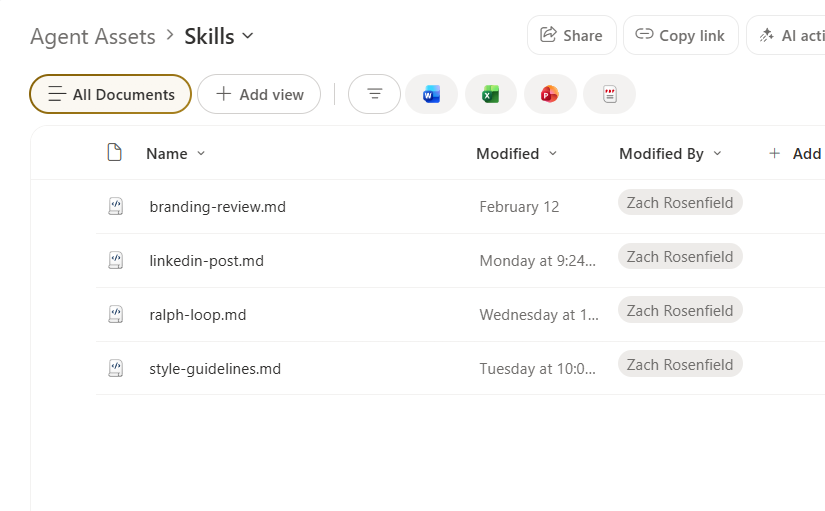

# Skills

AI skills are instruction files you can load into Copilot, an agent, or any AI assistant to give it a focused capability. Download the `.md` file and paste it into your agent's instructions or system prompt.

## Available Skills

| File | Skill | Description | Demo |
|---|---|---|---|
| [authoring-sharepoint-markdown.md](./authoring-sharepoint-markdown.md) | Authoring SharePoint Markdown | Converts documents and gathered content into SharePoint-compatible markdown files. Covers formatting rules, templates, and a six-step workflow for publishing to SharePoint pages and web parts. | — |
| [brainstorming-design-docs.md](./brainstorming-design-docs.md) | Brainstorming to Design Doc | Guides a raw idea through structured brainstorming into a complete design document. Asks clarifying questions one at a time, proposes alternatives with trade-offs, builds the design incrementally with user approval, then delivers SharePoint-ready Markdown. | — |
| [copy-editing.md](./copy-editing.md) | Copy Editing | Edits documents using seven sequential sweeps: Clarity, Voice & Tone, So What, Prove It, Specificity, Scannability, and Action. Run all sweeps for a full edit, or target a specific one. | — |
| [decision-log.md](./decision-log.md) | Decision Log | Extracts Decision Records from video or audio transcripts. Captures the problem, options considered, who decided, rationale, dissent, conditions, and follow-on actions. Produces a durable decision audit trail, not a meeting narrative. | — |
| [executive-summary.md](./executive-summary.md) | Executive Summary | Distills long documents, reports, or transcripts into tight one-page summaries for leadership audiences. Surfaces the core situation, key findings, recommendation, and what the reader needs to do. | — |
| [faq-building.md](./faq-building.md) | FAQ Building | Builds structured FAQ pages from source documents, policies, process guides, or topic briefs. Anticipates reader questions, groups them into themes, writes clear Q&A pairs, and delivers SharePoint-ready Markdown. | — |
| [forest-style.md](./forest-style.md) | Forest-Style Brand | Applies the forest-style brand system to any visual output, document, web content, presentation, or interface element. Covers the full color palette, typography, spacing, component styles, and voice rules. See also: [branding.md](../branding.md) for a quick-reference cheat sheet. | — |
| [gap-analysis.md](./gap-analysis.md) | Gap Analysis | Compares two documents and surfaces what is missing, conflicting, changed, or new between them. Categorizes findings by severity and summarizes implications and recommended actions. | — |
| [linkedin-post.md](./linkedin-post.md) | LinkedIn Post Writing | Crafts high-performing LinkedIn posts from any topic, story, announcement, or idea. Covers hook formulas, format rules, five content types, and an optimization checklist. | — |
| [meeting-notes.md](./meeting-notes.md) | Meeting Notes | Transforms raw video or audio transcripts into polished, structured meeting summaries. Handles messy auto-generated transcripts, extracts decisions, action items, discussion threads, and key quotes. | — |
| [project-brief.md](./project-brief.md) | Project Brief | Turns a rough idea or stakeholder request into a structured project brief. Asks clarifying questions to establish problem, goals, success criteria, scope, stakeholders, and risks, then delivers a decision-ready document. | — |
| [ralph-loop.md](./ralph-loop.md) | RALPH Loop | A self-evaluating iterative execution pattern (Reason → Act → Look → Probe → Harden). Keeps the agent looping until all success criteria hit a configurable score threshold. Use for document generation, analysis, or any quality-sensitive task. | — |
| [style-guidelines.md](./style-guidelines.md) | Brand Style Guide Template | A fill-in-the-blank template for turning any organization's brand guide into an AI skill. Covers color palette, typography, spacing tokens, and component styles. | — |
| [uppababy-brand-review.md](./uppababy-brand-review.md) | UPPAbaby Brand Compliance Review | Reviews any content file (image, Word doc, Excel, PowerPoint, PDF, or text) against UPPAbaby brand guidelines. Produces a weighted scorecard across five categories — Voice & Tone, Visual Identity, Messaging Alignment, Photography, and Brand Consistency — plus a prioritized list of critical, major, and minor remediation steps. | — |

## Installing a Skill in SharePoint

Skills must be uploaded as `.md` files to a specific location in SharePoint so agents can discover and load them automatically.

**Steps:**

1. In your SharePoint site, open the **Agent Assets** library
2. Navigate into the **Skills** folder (create it if it doesn't exist)
3. Upload the `.md` file — drag and drop or use **+ Add → Upload files**
4. Once uploaded, any agent connected to this site can reference the skill by name

> **Tip:** Keep skill file names lowercase with hyphens (e.g., `copy-editing.md`). The `name` field in the frontmatter is what the agent uses to identify the skill — the filename just needs to be recognizable to you.

## How to Use a Skill Outside SharePoint

1. Open the `.md` file and copy the contents
2. Paste into your agent's **Instructions** field (Copilot Studio, SharePoint agent, etc.) or prepend it to your chat as a system message
3. The skill's frontmatter `name` and `description` fields help the agent know when to apply it automatically

## Contributing a Skill

Skills work best when they are:
- **Focused** — one capability per file
- **Self-contained** — no external dependencies required to use it
- **Documented** — frontmatter with `name` and `description` so agents can self-select the skill
